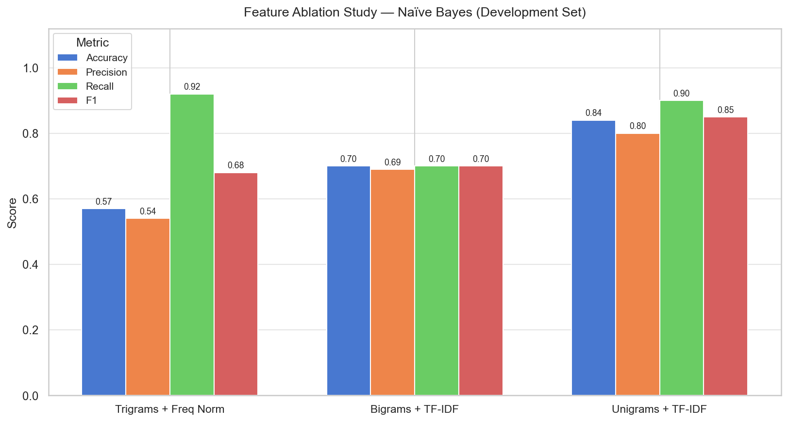
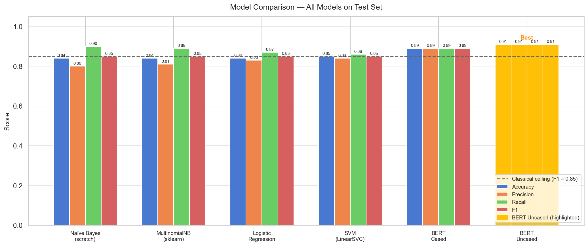
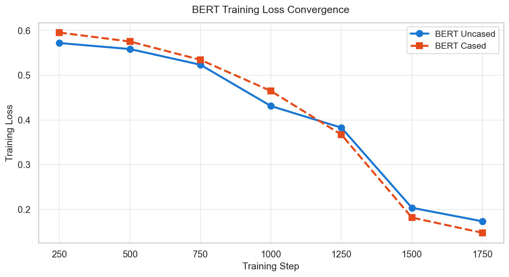
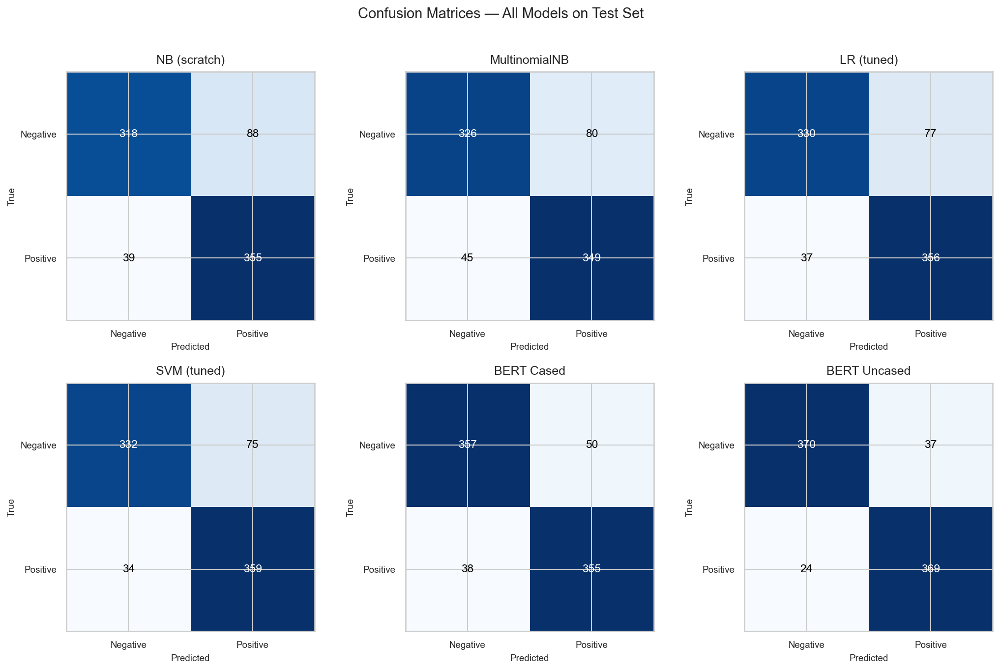

# Sentiment Analysis NLP Pipeline

End-to-end sentiment analysis on the **Cornell Movie Review Dataset** (2,000 positive + 2,000 negative reviews), progressing from classical bag-of-words models to fine-tuned BERT transformers.

The project was built in two stages: a classical NLP pipeline exploring how feature representation and classifier choice each contribute to performance, and a BERT fine-tuning stage to measure the ceiling that contextual embeddings can reach.

---

## Project Structure

```
sentiment-analysis-nlp/
├── src/
│   ├── __init__.py
│   ├── preprocessing.py   # tokeniseText, processTexts, stemmingTokenize, lemmaTokenize
│   ├── features.py        # tfidf, trigramsFeature, bigramsFeature, unigramsFeature, ppmiFeature, extractFeature
│   ├── models.py          # fit, predict (scratch NB), MNB, LR, SVM wrappers
│   └── evaluate.py        # evaluateModel, plotConfusionMatrix, log_to_wandb
├── notebooks/
│   ├── 01_classical_nlp_pipeline.ipynb
│   ├── 02_bert_finetuning.ipynb
│   └── 03_visualisations.ipynb
├── tests/
│   ├── conftest.py
│   └── test_implementations.py
├── assets/                # saved plot images
└── README.md
```

---

## Pipeline Overview

**Classical pipeline** (`01_classical_nlp_pipeline.ipynb`)

1. Data ingestion - Cornell Movie Review Dataset (pos/neg folders)
2. Preprocessing - NLTK tokenisation, stopword removal, stemming / lemmatisation
3. Feature extraction - Trigrams (freq-norm), Bigrams (TF-IDF), Unigrams (TF-IDF), Bigrams (PPMI)
4. Naïve Bayes - from scratch (Laplace smoothing, log-space)
5. sklearn benchmarks - MultinomialNB, Logistic Regression, LinearSVC
6. Hyperparameter tuning

**BERT pipeline** (`02_bert_finetuning.ipynb`)

- Fine-tunes - `bert-base-cased` and `bert-base-uncased` using HuggingFace `Trainer`
- See `requirements.txt` for dependencies

---

## Results

| Model | Accuracy | Precision | Recall | F1 |
|---|---|---|---|---|
| Naïve Bayes (scratch) — Trigrams + Freq Norm | 0.57 | 0.54 | 0.92 | 0.68 |
| Naïve Bayes (scratch) — Bigrams + TF-IDF | 0.70 | 0.69 | 0.70 | 0.70 |
| Naïve Bayes (scratch) — Unigrams + TF-IDF | 0.84 | 0.80 | 0.90 | 0.85 |
| MultinomialNB (sklearn) | 0.84 | 0.81 | 0.89 | 0.85 |
| Logistic Regression | 0.84 | 0.83 | 0.87 | 0.85 |
| SVM (LinearSVC) | 0.85 | 0.84 | 0.86 | 0.85 |
| BERT Cased | 0.89 | 0.89 | 0.89 | 0.89 |
| **BERT Uncased** | **0.91** | **0.91** | **0.91** | **0.91** |

### Key Takeaways

- **Feature representation matters far more than classifier choice.** Swapping the feature set moves F1 by up to 17 points (trigrams → unigrams); swapping classifiers on the same features moves it by under 2 points. Engineering better inputs is the highest-leverage decision in classical NLP.
- **All classical models hit a hard ceiling at ~0.85 F1.** Not a classifier limitation but rather it is a representation limitation. Bag-of-words discards word order entirely, so negation (*"not good"*), intensifiers, and sarcasm are invisible to every classical model regardless of how sophisticated it is.
- **BERT breaks the ceiling by 6 points (0.91 F1) through contextual embeddings.** Bidirectional attention captures what bag-of-words cannot: how the meaning of a word depends on the words around it. Notably, BERT Uncased outperforms Cased; for sentiment tasks, capitalisation adds vocabulary noise without proportional benefit.

### Visualisations









---

## Data

Download the **Cornell Movie Review Dataset** from:
[https://www.cs.cornell.edu/people/pabo/movie-review-data/](https://www.cs.cornell.edu/people/pabo/movie-review-data/)

Extract it so the project has `data/pos/` and `data/neg/` folders at the root. The notebooks load from these paths.

## Setup

```bash
pip install -r requirements.txt
```

To run the unit tests:

```bash
pytest tests/ -v
```

BERT fine-tuning requires a GPU and the optional dependencies listed in `requirements.txt`. The classical pipeline and tests run on CPU only.

## Optional: Weights & Biases Tracking

```bash
pip install wandb
```

Then call `from src.evaluate import log_to_wandb` in any notebook, see `01_classical_nlp_pipeline.ipynb` for a usage example.
